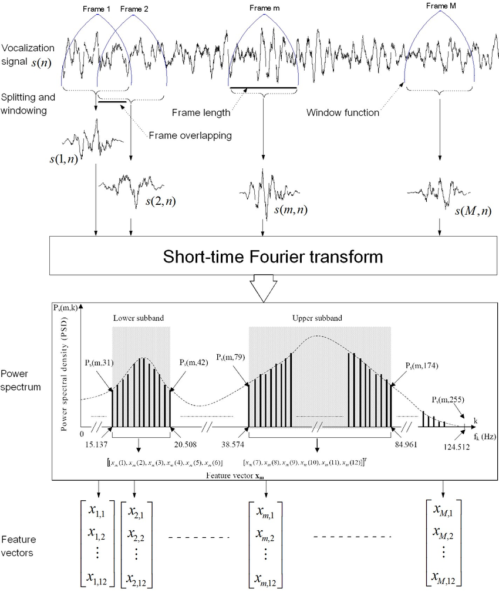
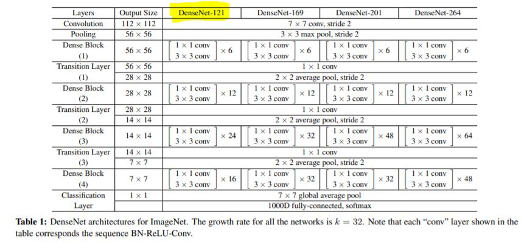
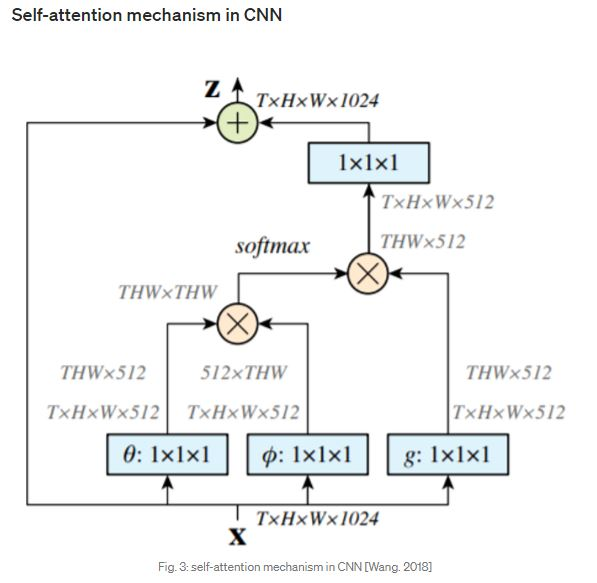

# Identification model


## 1. Audio signal processing
___

First, we process the wav file through functions in order to obtain a mel-spectrogram that we will feed into the model. 

You can find very good explanations about audio signal processing for machine learning on this youtube channel : [Audio Signal Processing for Machine Learning](https://www.youtube.com/playlist?list=PL-wATfeyAMNqIee7cH3q1bh4QJFAaeNv0)

Spectrogram helping class is called with parameters regarding to audio signal: 

```python
Spectrogram(nn.Module):
    def __init__(self, n_fft=2048, hop_length=None, win_length=None, 
        window='hann', center=True, pad_mode='reflect', power=2.0, 
        freeze_parameters=True)
```
    
n_fft = window size applied on a frame of the sound signal 
hop_length = number of samples the window slides on the sound signal before applying window function
window = window function applied (‘hann’)

this function calls the Short Time Fourier Transform function (STFT) in order to return the spectrogram. 

 <caption><center> <u> Figure 1 </u>: Example of feature extraction process based on the short-time Fourier transform (STFT)<br> </center></caption>

Example of feature extraction process based on the short-time Fourier transform (STFT). Power spectrum density P s (m, k) of each signal frame s(m, k) is computed using the STFT. The feature vector x m is constructed by extracting six components from lower subband (15.1375–20.508 Hz) and six components from upper subband (38.574–84.961 Hz). The discrete frequencies are obtained with a sampling frequency of 250 Hz and a frame length of 512 samples.

Source : [FPGA Implementation of Blue Whale Calls Classifier Using High-Level Programming Tool - Scientific Figure on ResearchGate](https://www.researchgate.net/figure/Feature-extraction-process-based-on-the-short-time-Fourier-transform-STFT-Power_fig3_293009457)

↓

Spectrogram

↓

The spectrogram is passed on LogmelFilterBank in order to obtain a logmel spectrogram :

```python
class LogmelFilterBank(nn.Module)

self.melW = librosa.filters.mel(sr=sr, n_fft=n_fft, n_mels=n_mels,
            fmin=fmin, fmax=fmax).T

self.melW = nn.Parameter(torch.Tensor(self.melW))

power_to_db(self, input) (S, ref=1.0, amin=1e-10, top_db=80.0)
```

power_to_db converts a power spectrogram (amplitude squared) to decibel (dB) units. This computes the scaling 10 * log10(S / ref) in a numerically stable way.

Logmel spectrogram

↓

Batch Normalization 2D

↓

Possibility of SpecAugmentation (not used in our case) 

```python
SpecAugmentation(
            time_drop_width=64,
            time_stripes_num=2,
            freq_drop_width=8,
            freq_stripes_num=2)
```

Reference paper :  [Specaugment: A simple data augmentation method for automatic speech recognition.](https://arxiv.org/abs/1904.08779)

SpecAugmentation sets a time dropper and a frequency dropper then the DropStripes function does it.

↓

At this point we have: 
x (batch_size, 1, time_steps, mel_bins),
frames_num

↓

2nd dimension of x is expanded from 1 to 3 channels and x is fed to DenseNet121. DenseNet121 is used as feature extractor.


## 2. CNN feature extractor: DenseNet121
___

Densenet121 Reference paper : [Densely Connected Convolutional Networks](https://arxiv.org/pdf/1608.06993.pdf)

 <caption><center> <u> Figure 2 </u>: DenseNet architecture<br> </center></caption>

↓

After passing through densenet, frequency axis is aggregated (mean) 
```python
# Aggregate in frequency axis
x = torch.mean(x, dim=3)
```
↓

Pooling layers max and avg, then they are added

```python
x1 = F.max_pool1d(x, kernel_size=3, stride=1, padding=1)
x2 = F.avg_pool1d(x, kernel_size=3, stride=1, padding=1)
x = x1 + x2
```
↓

Dropout p = 0.5

↓

FC1

↓

ReLU

↓

Dropout p = 0.5

↓

Attention Block: classification for each segment


## 3. Classification for each segment with a self-attention mechanism
___

```python
(clipwise_output, norm_att, segmentwise_output) = self.att_block(x)
```

 <caption><center> <u> Figure 3 </u>: Example of a self-attention mechanism in a CNN <br> </center></caption>
(source : [Non-local Neural Networks](https://arxiv.org/abs/1711.07971))


Weights are initialized with Xavier initialization. Attention block uses 1D convolution layer with a kernel size of 1 (att() and cla()). Then it outputs self attention map and classification :

```python
def forward(self, x):
# x: (n_samples, n_in, n_time)

        #calculate self-attention map along time axis: 
        norm_att = torch.softmax(torch.tanh(self.att(x)), dim=-1)
        # calculates segment wise classification result:        
        cla = self.nonlinear_transform(self.cla(x))
        # attention aggregation is performed to get clip wise prediction: 
        x = torch.sum(norm_att * cla, dim=2) 
        
        return x, norm_att, cla
```

A segment prediction counts for a frame prediction. So interpolate() and pad_framewise_output() helps to get the right dimensions back. (not used in our case)


↓

clipwise predition is saved in the output dictionnary 


